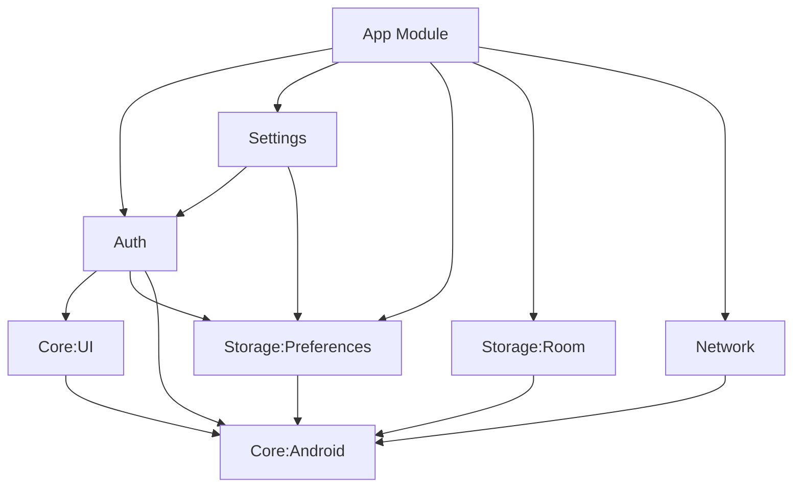

<p align="center">
    <a href="https://github.com/atick-faisal/Jetpack-Compose-Starter/releases"></a>
    <a href="https://github.com/atick-faisal/Jetpack-Compose-Starter/issues"></a>
    <a href="https://github.com/atick-faisal/Jetpack-Compose-Starter/contributors"></a>
    
</p>

# Jetpack Compose Starter 🚀

A robust, production-ready template for modern Android development that takes the pain out of setting up a new project. Built on the foundation of [Now In Android](https://github.com/android/nowinandroid)'s architecture, this template provides a comprehensive starting point for both new and experienced Android developers.

## Why This Template?

- **Production-Ready Authentication**: Firebase authentication with Google Sign-In and email/password, including secure credential management
- **Clean Architecture**: Clear separation of concerns with a modular, scalable architecture
- **Modern Tech Stack**: Leverages the latest Android development tools and libraries including Jetpack Compose, Kotlin Coroutines, and Dagger Hilt
- **Type-Safe Navigation**: Fully typed navigation using Kotlin serialization
- **Robust Data Management**: Complete data layer with Repository pattern, Room database, and Preferences DataStore
- **Network Communication**: Retrofit + OkHttp setup with proper error handling and interceptors
- **CI/CD**: Automate build, release and Play Store deployment using GitHub actions and Fastlane

> [!NOTE]
> The codebase follows a set of conventions that prioritize simplicity and maintainability. Understanding these patterns will help you develop effectively.

## Some Apps Built Using This Template


Check out the whole list [here](https://github.com/atick-faisal?tab=repositories&q=&type=source&language=kotlin&sort=).

## Technical Stack

### Core Libraries
- **UI**: Jetpack Compose, Material3, Navigation Compose
- **DI**: Dagger Hilt
- **Async**: Kotlin Coroutines & Flow
- **Network**: Retrofit, OkHttp, Kotlinx Serialization
- **Storage**: Room DB, DataStore Preferences
- **Images**: Coil

### Build & Tools
- Kotlin 2.0
- Gradle 8.11.1 with Version Catalogs
- Java 21
- Custom Gradle Convention Plugins
- Spotless for code formatting

### Architecture Components
- MVVM with Clean Architecture
- Repository Pattern  
- Modular design with feature isolation
- Firebase Authentication
- Single Activity
- DataStore for preferences
- Kotlinx Serialization for JSON
- Type-safe navigation

### Development Features
- Debug/Release variants 
- Firebase Crashlytics integration
- GitHub Actions CI/CD
- Automatic dependency updates with Renovate
- Code documentation with Dokka

## Project Architecture



## Architecture Layers

The codebase follows a clean architecture pattern with clear separation of concerns across different layers. Each layer has specific responsibilities and dependencies flow inward, with the domain layer at the center.

### Data Layer

The data layer is responsible for handling data operations and is organized into the following components:

- **Data Sources**: Located in `*DataSource` classes (e.g., `NetworkDataSource`, `AuthDataSource`)
  - Handle raw data operations with external systems (API, database, etc.)
  - Perform data transformations and mapping
  - Example: `AuthDataSourceImpl` in the auth module handles raw Firebase authentication operations

> [!NOTE]
> Data sources should expose Flow for observable data and suspend functions for one-shot operations:
> ```kotlin
> interface DataSource {
>     fun observeData(): Flow<Data>
>     suspend fun updateData(data: Data)
> }
> ```

- **Models**: Found in `models` packages across modules
  - Define data structures for external data sources
  - Contain serialization/deserialization logic
  - Example: `NetworkPost` in the network module represents raw API responses
 
> [!IMPORTANT]
> Always keep data models immutable and use data classes:
> ```kotlin
> data class NetworkResponse(
>     val id: Int,
>     val data: String
> )
> ```

The data layer is implemented across several modules:
- `network/`: Handles remote API communication
- `storage/preferences/`: Manages local data persistence using DataStore
- `storage/room/`: Handles SQLite database operations using Room

> [!WARNING]
> Don't expose data source interfaces directly to ViewModels. Always go through repositories:
> ```kotlin
> // DO THIS
> class MyViewModel(
>     private val repository: MyRepository
> )
> 
> // DON'T DO THIS
> class MyViewModel(
>     private val dataSource: MyDataSource
> )
> ```

### Repository Layer

The repository layer acts as a single source of truth and mediates between data sources:

- **Repositories**: Found in `repository` packages (e.g., `AuthRepository`)
  - Coordinate between multiple data sources
  - Implement business logic for data operations
  - Abstract data sources from the UI layer
  - Handle caching strategies
  - Example: `AuthRepositoryImpl` coordinates between Firebase Auth and local preferences

Key characteristics:
- Uses Kotlin Result type for error handling
- Implements caching where appropriate
- Exposes Kotlin Flow for reactive data updates

> [!IMPORTANT]
> Always return `Result<T>` from repository methods. This ensures consistent error handling across the app:
> ```kotlin
> suspend fun getData(): Result<Data> = suspendRunCatching {
>     dataSource.getData()
> }
> ```

### UI Layer

The UI layer follows an MVVM pattern and consists of:

- **ViewModels**: Located in `ui` packages
  - Manage UI state and business logic
  - Handle user interactions
  - Communicate with repositories
  - Example: `AuthViewModel` manages authentication state and user actions

- **Screens**: Found in `ui` packages alongside their ViewModels
  - Compose UI components
  - Handle UI layouts and styling
  - Observe ViewModel state
  - Example: `SignInScreen` displays login form and handles user input

- **State Management**:
  - Uses `UiState<T>` data class for managing loading, error, and success states
  - Employs `StateFlow` for reactive UI updates
  - Handles one-time events using `OneTimeEvent<T>`

 
> [!TIP]
> Always use `UiState` wrapper for ViewModel states. This ensures consistent error and loading handling across the app.
> ```kotlin
> data class UiState<T : Any>(
>     val data: T,
>     val loading: Boolean = false,
>     val error: OneTimeEvent<Throwable?> = OneTimeEvent(null)
> )
> ```

> [!WARNING]
> Don't create custom loading or error handling in individual screens. Use StatefulComposable instead:
> ```kotlin
> // DON'T DO THIS
> if (isLoading) {
>     CircularProgressIndicator()
> }
> 
> // DO THIS
> StatefulComposable(state = uiState) { data ->
>     // Your UI content
> }
> ```

### Data Flow

The typical data flow follows this pattern:

1. **UI Layer**:
   ```
   User Action → ViewModel → Repository
   ```

2. **Repository Layer**:
   ```
   Repository → Data Sources → External Systems
   ```

3. **Data Flow Back**:
   ```
   External Systems → Data Sources → Repository → ViewModel → UI
   ```

### State Management and Data Structures

The codebase uses several key data structures for state management:

1. **UiState<T>**:
   ```kotlin
   data class UiState<T : Any>(
       val data: T,
       val loading: Boolean = false,
       val error: OneTimeEvent<Throwable?> = OneTimeEvent(null)
   )
   ```
   - Wraps UI data with loading and error states
   - Used by ViewModels to communicate state to UI

2. **Result<T>**:
   - Used by repositories to handle success/failure
   - Propagates errors up the stack
   - Example: `Result<AuthUser>` for authentication operations

3. **StateFlow**:
   - Used for reactive state management
   - Provides hot, stateful event streams
   - Example: `_authUiState: MutableStateFlow<UiState<AuthScreenData>>`

4. **OneTimeEvent<T>**:
   - Errors propagate up through Result<T>
   - They get converted to OneTimeEvent when reaching the UI layer
   - This ensures error Snackbars only show once and don't reappear on recomposition
  
> [!IMPORTANT]
> Use `StatefulComposable` for screens that need loading or error handling. This component handles these states automatically, reducing boilerplate and ensuring consistent behavior.
> ```kotlin
> StatefulComposable(
>     state = viewModel.state,
>     onShowSnackbar = { msg, action -> /* ... */ }
> ) { data ->
>     // Your UI content here
> }
> ```

> [!TIP]
> Use the provided extension functions for updating state:
> ```kotlin
> // For regular state updates
> _uiState.updateState { copy(value = newValue) }
> 
> // For async operations
> _uiState.updateStateWith(viewModelScope) {
>     repository.someAsyncOperation()
> }
> ```

## Design Philosophy

This codebase prioritizes pragmatic simplicity over theoretical purity, making conscious tradeoffs that favor maintainability and readability over absolute correctness or flexibility. Here are some key examples of this philosophy:

### Centralized State Management

#### Simplified Error and Loading Handling

Instead of implementing error and loading states individually for each screen, we handle these centrally through the `StatefulComposable`:

```kotlin
@Composable
fun <T : Any> StatefulComposable(
    state: UiState<T>,
    onShowSnackbar: suspend (String, String?) -> Boolean,
    content: @Composable (T) -> Unit
) {
    content(state.data)

    if (state.loading) {
        // Centralized loading indicator
    }

    state.error.getContentIfNotHandled()?.let { error ->
        // Centralized error handling
    }
}
```

**Tradeoff:**
- ✅ **Simplicity**: UI components only need to focus on their happy path
- ✅ **Consistency**: Error and loading states behave uniformly across the app
- ❌ **Flexibility**: Less control over specific error/loading UI for individual screens

### Direct State Management in ViewModels

While the NowInAndroid codebase promotes a functional approach using Flow operators and transformations, we opt for a more direct approach using MutableStateFlow:

```kotlin
// Our simplified approach
class AuthViewModel @Inject constructor(
    private val authRepository: AuthRepository,
) : ViewModel() {
    private val _authUiState = MutableStateFlow(UiState(AuthScreenData()))
    val authUiState = _authUiState.asStateFlow()

    fun updateEmail(email: String) {
        _authUiState.updateState {
            copy(
                email = TextFiledData(
                    value = email,
                    errorMessage = if (email.isEmailValid()) null else "Email Not Valid"
                )
            )
        }
    }
}
```

**Tradeoff:**
- ✅ **Readability**: State changes are explicit and easy to trace
- ✅ **Simplicity**: Easier to manage multiple UI events and loading states
- ✅ **Debuggability**: Direct state mutations are easier to debug
- ❌ **Purity**: Less adherence to functional programming principles
- ❌ **Resource Management**: No automatic cleanup of subscribers when the app is in background (compared to `SharingStarted.WhileSubscribed(5_000)`)

> [!NOTE]
> These patterns are guidelines, not rules. The goal is to make the codebase more maintainable and easier to understand, not to restrict flexibility where it's truly needed.


## Getting Started

### Prerequisites
- Android Studio Hedgehog or newer
- JDK 21
- Firebase account for authentication and crashlytics

### Initial Setup

1. Clone and open project:
```bash
git clone https://github.com/atick-faisal/Jetpack-Compose-Starter.git
```

2. Firebase setup:
- Create project in Firebase Console
- Download `google-services.json` to `app/`
- Add SHA fingerprint to Firebase Console for Google Sign-In:
```bash
./gradlew signingReport
```

> [!NOTE]
> Firebase authentication and crashlytics requires Firebase console setup and the `google-services.json` file. I have provided a template to ensure a successful build. However, you need to provide your own in order to use all the functionalities.


3. Running the App or Demo:
   
   There is a demo application bundled with the template. To run it, select `demo` from the run configurations. To run the app, select `app` instead.
    
> [!IMPORTANT]
> The demo module is completely optional and can be removed by:  
> - Deleting the `demo` directory
> - Removing its entry from `settings.gradle.kts` 


### Release Setup

1. Create `keystore.properties` in project root:
```properties
storePassword=****
keyPassword=****
keyAlias=****
storeFile=keystore-file-name.jks
```

2. Place keystore file in `app/`

3. Build release:
```bash
./gradlew assembleRelease
```

## Adding a New Feature: Step-by-Step Guide

This guide walks through the process of adding a new feature to the app, following the established patterns and conventions.

### Step 1: Define Data Models

Start by defining your data models in the appropriate layer:

1. **Network Models** (if feature requires API calls):
```kotlin
// network/src/main/kotlin/dev/atick/network/models/
@Serializable
data class NetworkFeatureData(
    val id: Int,
    val title: String
)
```

2. **UI Models** (what your screen will display):
```kotlin
// feature/src/main/kotlin/dev/atick/feature/models/
data class FeatureScreenData(
    val title: String,
    val description: String = "",
    // ... other UI state
)
```

### Step 2: Create Data Source

1. **Define the interface**:
```kotlin
// feature/src/main/kotlin/dev/atick/feature/data/
interface FeatureDataSource {
    suspend fun getFeatureData(): List<NetworkFeatureData>
    fun observeFeatureData(): Flow<List<NetworkFeatureData>>
}
```

2. **Implement the data source**:
```kotlin
class FeatureDataSourceImpl @Inject constructor(
    private val api: FeatureApi,
    @IoDispatcher private val ioDispatcher: CoroutineDispatcher
) : FeatureDataSource {
    override suspend fun getFeatureData(): List<NetworkFeatureData> {
        return withContext(ioDispatcher) {
            api.getFeatureData()
        }
    }
    
    override fun observeFeatureData(): Flow<List<NetworkFeatureData>> {
        return flow {
            // Implementation
        }.flowOn(ioDispatcher)
    }
}
```

### Step 3: Create Repository

1. **Define repository interface**:
```kotlin
// feature/src/main/kotlin/dev/atick/feature/repository/
interface FeatureRepository {
    suspend fun getFeatureData(): Result<List<FeatureData>>
}
```

2. **Implement repository**:
```kotlin
class FeatureRepositoryImpl @Inject constructor(
    private val dataSource: FeatureDataSource
) : FeatureRepository {
    override suspend fun getFeatureData(): Result<List<FeatureData>> = 
        suspendRunCatching {
            dataSource.getFeatureData().map { it.toFeatureData() }
        }
}
```

### Step 4: Create ViewModel

```kotlin
// feature/src/main/kotlin/dev/atick/feature/ui/
@HiltViewModel
class FeatureViewModel @Inject constructor(
    private val repository: FeatureRepository
) : ViewModel() {
    private val _uiState = MutableStateFlow(UiState(FeatureScreenData()))
    val uiState = _uiState.asStateFlow()

    init {
        loadData()
    }

    private fun loadData() {
        _uiState.updateStateWith(viewModelScope) {
            repository.getFeatureData()
                .map { data -> /* transform to screen data */ }
        }
    }

    fun onUserAction(/* params */) {
        _uiState.updateState {
            copy(/* update state */)
        }
    }
}
```

### Step 5: Create UI Components

1. **Create screen composable**:
```kotlin
// feature/src/main/kotlin/dev/atick/feature/ui/
@Composable
fun FeatureRoute(
    onShowSnackbar: suspend (String, String?) -> Boolean,
    viewModel: FeatureViewModel = hiltViewModel()
) {
    val uiState by viewModel.uiState.collectAsStateWithLifecycle()
    
    StatefulComposable(
        state = uiState,
        onShowSnackbar = onShowSnackbar
    ) { screenData ->
        FeatureScreen(
            screenData = screenData,
            onAction = viewModel::onUserAction
        )
    }
}

@Composable
private fun FeatureScreen(
    screenData: FeatureScreenData,
    onAction: () -> Unit
) {
    // UI implementation
}
```

2. **Add preview**:
```kotlin
@DevicePreviews
@Composable
private fun FeatureScreenPreview() {
    FeatureScreen(
        screenData = FeatureScreenData(/* sample data */),
        onAction = {}
    )
}
```

### Step 6: Setup Navigation

1. **Define navigation endpoints**:
```kotlin
// feature/src/main/kotlin/dev/atick/feature/navigation/
@Serializable
data object FeatureNavGraph
@Serializable
data object Feature
```

2. **Add navigation extensions**:
```kotlin
fun NavController.navigateToFeature(navOptions: NavOptions? = null) {
    navigate(Feature, navOptions)
}

fun NavGraphBuilder.featureScreen(
    onShowSnackbar: suspend (String, String?) -> Boolean
) {
    composable<Feature> {
        FeatureRoute(
            onShowSnackbar = onShowSnackbar
        )
    }
}

fun NavGraphBuilder.featureNavGraph(
    nestedGraphs: NavGraphBuilder.() -> Unit
) {
    navigation<FeatureNavGraph>(
        startDestination = Feature
    ) {
        nestedGraphs()
    }
}
```

### Step 7: Setup Dependency Injection

1. **Add module for data source**:
```kotlin
@Module
@InstallIn(SingletonComponent::class)
abstract class DataSourceModule {
    @Binds
    @Singleton
    abstract fun bindFeatureDataSource(
        impl: FeatureDataSourceImpl
    ): FeatureDataSource
}
```

2. **Add module for repository**:
```kotlin
@Module
@InstallIn(SingletonComponent::class)
abstract class RepositoryModule {
    @Binds
    @Singleton
    abstract fun bindFeatureRepository(
        impl: FeatureRepositoryImpl
    ): FeatureRepository
}
```

## Final Checklist

✅ Data models defined  
✅ Data source interface and implementation created  
✅ Repository interface and implementation created  
✅ ViewModel handling state and user actions  
✅ UI components with previews  
✅ Navigation setup  
✅ Dependency injection modules  


## Documentation

<br>
<p align="center">
        
    <br>
    <a href="https://atick.dev/Jetpack-Compose-Starter">Read The Documentation Here</a>
</p>

<p align="center"></p>
<p align="center"><a href="https://sites.google.com/view/mchowdhury" target="_blank">Qatar University Machine Learning Group</a>
<p align="center"><a href="https://github.com/atick-faisal/Jetpack-Compose-Starter/blob/main/LICENSE"></a></p>
