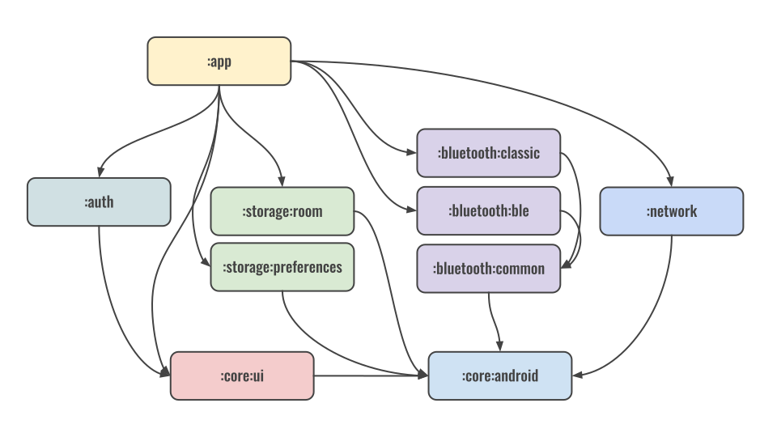

<p align="center">
    <a href="https://github.com/atick-faisal/Jetpack-Compose-Starter/releases"></a>
    <a href="https://github.com/atick-faisal/Jetpack-Compose-Starter/issues"></a>
    <a href="https://github.com/atick-faisal/Jetpack-Compose-Starter/contributors"></a>
    
</p>

## What is it

It's a starting template that I use for all my Android apps. It is based on the architecture of the [Now In Android](https://github.com/android/nowinandroid) app by Google. Check out the app from the latest [Release](https://github.com/atick-faisal/Jetpack-Compose-Starter/releases).


> [!WARNING]
> Firebase authentication and crashlytics requires Firebase console setup and the `google-services.json` file. I have provided a template to ensure a successful build. However, you need to provide your own in order to use all the functionalities.

## App Architecture

The architecture of this project follows a **[multi-module](https://developer.android.com/topic/modularization)** and **[unidirectional data flow](https://developer.android.com/develop/ui/compose/architecture)** approach, ensuring separation of concerns and ease of maintenance. Each module in the app is responsible for a specific feature or functionality, and the structure is consistent across all modules, making it easier to navigate and manage the codebase.

### Structure of a Module

Each feature is encapsulated in a module. For example, the `auth` module handles user authentication, while other modules might manage additional features like local storage, remote API, etc.

The modules follow a clear, layered architecture:
- **UI Layer**: This is where the app's UI logic resides. This template enforces the use of [Jetpack Compose](https://developer.android.com/compose) throughout the UI.
- **ViewModel Layer**: The `ViewModel` handles the business logic, exposing `StateFlow` to represent the state of the UI. It interacts with the repository and responds to UI events.
- **Repository Layer**: The repository abstracts data sources, ensuring that the ViewModel does not have direct access to them. It is responsible for data management and communicating with one or multiple data sources.
- **Data Source Layer**: This layer interacts with external APIs, local databases, or any other data sources and provides the data to the repository.

### Dependency Injection

To maintain loose coupling and facilitate easier testing, **Dagger Hilt** is used for dependency injection. Each layer (UI, ViewModel, Repository, Data Source) injects its dependencies using Hilt, ensuring that each class only depends on abstractions (interfaces) rather than concrete implementations.

For example, in the `auth` module:
- The `AuthViewModel` depends on the `AuthRepository`.
- The `AuthRepository` depends on the `AuthDataSource`.
- Each of these layers has their concrete implementations injected using Hilt, making it easy to swap implementations if needed.

## Guidelines
### Data Source
Great, here’s how we can write the **Data Source** subsection based on your points:

### Data Source Design Guidelines

The **Data Source** layer is responsible for handling all data operations such as interacting with APIs, databases, or external services. Follow these key principles to ensure consistency and maintainability across the app:

1. **Interface and Implementation**:  
   Every data source must be designed with an **interface** that defines the data operations and an **implementation** that handles the actual logic. This separation ensures flexibility and the ability to switch data sources or mock them for testing.

2. **Suspend Functions for Long-Running Tasks**:  
   Any long-running operation in the data layer, such as network or database calls, should use **suspend functions** to avoid blocking the main thread. Avoid using functions with callbacks; if callbacks are required (e.g., for third-party libraries), convert them to suspend functions using `callbackFlow` or `suspendCancellableCoroutine` to maintain clean, Kotlin idiomatic code.

3. **Reactive Data Flow**:  
   When exposing reactive streams of data (such as updates from APIs or databases), use Kotlin’s **StateFlow** or **SharedFlow**. These ensure consistency and are recommended over legacy reactive patterns (e.g., LiveData, RxJava) in this architecture.

4. **Error Handling**:  
   The data source should not handle errors directly. Any errors encountered in the data layer must be propagated to the **Repository** layer for proper handling, ensuring that the data layer remains focused solely on data retrieval and manipulation.

5. **Coroutine Dispatchers**:  
   Within suspending functions, always use appropriate **coroutine dispatchers** (e.g., `Dispatchers.IO` for network or disk operations). The dispatcher should be injected into the implementation class using **Dagger Hilt**. This keeps the implementation flexible and testable, allowing the dispatcher to be swapped in tests if needed.

Here's an example of a data source implementation from the `:storage:preferences` module:

``` kotlin
interface UserPreferencesDataSource {
    val userData: Flow<UserData>
    suspend fun setThemeBrand(themeBrand: ThemeBrand)
}

class UserPreferencesDataSourceImpl @Inject constructor(
    private val datastore: DataStore<UserData>,
    @IoDispatcher private val ioDispatcher: CoroutineDispatcher,
) : UserPreferencesDataSource {
    override val userData: Flow<UserData>
        get() = datastore.data.flowOn(ioDispatcher)

    override suspend fun setThemeBrand(themeBrand: ThemeBrand) {
        withContext(ioDispatcher) {
            datastore.updateData { userData ->
                userData.copy(themeBrand = themeBrand)
            }
        }
    }
}
```
   In this example:
   - the `ioDispatcher` is injected into the impl class
   - `userData` is exposed as a reactive `Flow` data structure
   - `suspend` function with the injected dispatcher is used to perform long running tasks
   - No exception handling was done

### Repository Design Guidelines

The **Repository** layer is responsible for abstracting data management and interacting with one or more data sources. It serves as the middle layer between the ViewModel and Data Source layers. Follow these guidelines to design the repository layer consistently:

1. **Interface and Implementation**:  
   As with the data layer, the repository should have both an **interface** and an **implementation** class. The implementation class can depend on one or more data sources, coordinating between them to fulfill data requirements.

2. **Returning Result Objects**:  
   Each function in the repository should return a **Result** object, wrapping the actual return value. This ensures that the result encapsulates both success and failure, making error handling more streamlined in the ViewModel.

   To simplify the creation of `Result` objects, use Kotlin’s **`runCatching`** function, which allows you to easily catch and handle exceptions when calling functions from the data layer. Here's an example of how to structure this:

   ```kotlin
   interface AuthRepository {
       suspend fun signIn(username: String, password: String): Result<User>
   }

   class AuthRepositoryImpl @Inject constructor(
       private val authDataSource: AuthDataSource
   ) : AuthRepository {

       override suspend fun signIn(username: String, password: String): Result<User> {
           return runCatching {
               authDataSource.signIn(username, password)
           }
       }
   }
   ```

   In this example:
   - The `signIn` function calls the `AuthDataSource.signIn` function.
   - `runCatching` wraps the call, automatically handling any exceptions and returning a `Result` object, which can later be used by the ViewModel to process success or failure cases.

### ViewModel Design Guidelines

The **ViewModel** layer serves as the intermediary between the UI and the repository, managing the app's logic and state for each screen. Follow these key principles when designing ViewModels:

1. **Injecting Repositories**:  
   One or more repositories may be injected into the ViewModel using **Dagger Hilt**. This allows the ViewModel to access the necessary data from different sources while remaining agnostic to how the data is fetched or managed.

2. **Exposing StateFlow for UI State**:  
   Each ViewModel typically exposes a single **`StateFlow`** object that contains the UI state for the corresponding screen. This ensures a unidirectional data flow where the ViewModel provides state updates, and the UI observes and reacts to them.

3. **Single UI State Representation**:  
   All the required data for the screen should be encapsulated in a **single data class**. This data class is then wrapped in a `UiState` class, which manages the screen's loading, success, and error states. This pattern simplifies state management and ensures that the UI is always in sync with the ViewModel’s data.

4. **Data Fetching Pattern**:  
   The typical flow for data fetching in the ViewModel follows this sequence:
   - Set the `uiState` to **loading**.
   - Call the repository function to fetch data.
   - Update the `uiState` with the fetched data if successful, or with an error message if the fetch fails.

5. **Exposing Functions for UI Events**:  
   The ViewModel should expose functions that correspond to UI events, such as button clicks or form submissions. These functions typically trigger the appropriate data fetching or state updates.

Here’s a code example that follows these guidelines:

```kotlin
data class SignInUiState(
    val user: User? = null,
    val isLoading: Boolean = false,
    val error: String? = null
)

class AuthViewModel @Inject constructor(
    private val authRepository: AuthRepository
) : ViewModel() {

    // Expose the UI state using StateFlow
    private val _uiState = MutableStateFlow(SignInUiState())
    val uiState: StateFlow<SignInUiState> = _uiState

    // Function corresponding to the SignIn event in the UI
    fun signIn(username: String, password: String) {
        // Set the state to loading
        _uiState.value = _uiState.value.copy(isLoading = true)

        viewModelScope.launch {
            // Fetch data from the repository
            val result = authRepository.signIn(username, password)
            
            // Update the state based on the result
            _uiState.value = result.fold(
                onSuccess = { user -> 
                    SignInUiState(user = user)
                },
                onFailure = { error ->
                    SignInUiState(error = error.message)
                }
            )
        }
    }
}
```

In this example:
- The `SignInUiState` class represents the UI state, encapsulating all necessary screen data.
- The ViewModel exposes a `StateFlow` of `SignInUiState` for the UI to observe.
- The `signIn` function corresponds to the sign-in event triggered by the UI. It updates the `uiState` based on the repository's result.

### UI Design Guidelines

The **UI Layer** is built entirely using **Jetpack Compose** to create modern, declarative, and reactive UIs. Consistency and separation of concerns are crucial in this layer, allowing each screen to handle data and events cleanly. Follow these guidelines to maintain a cohesive structure:

1. **Use Jetpack Compose for UI**:  
   The entire UI of the app is built with Jetpack Compose. This ensures modern, declarative UI development without relying on XML layouts.

2. **Stateful and Stateless Versions of Each Screen**:  
   Each screen must have both a **stateful** and a **stateless** version.
   - The **stateful version** is responsible for interacting with the `ViewModel`, handling state, and providing the data and event callbacks to the stateless version.
   - The **stateless version** only takes the required data and event callbacks, making it easier to test and reuse.

3. **Stateful Composable for Automated Loading and Error Handling**:  
   The **stateful composable** wraps the stateless UI to provide automatic loading indicators and error handling. This keeps the actual UI clean, while handling common states (loading, error) consistently across all screens.

Here’s an example of how to structure a stateful and stateless screen using the `StatefulComposable`:

```kotlin
// Stateless SignIn screen
@Composable
fun SignInScreen(
    uiState: SignInUiState,
    onSignIn: (String, String) -> Unit
) {
    // Compose the actual UI using the uiState data and event callbacks
    Column {
        TextField(
            value = uiState.username,
            onValueChange = { newUsername -> onSignIn(newUsername, uiState.password) },
            label = { Text("Username") }
        )
        TextField(
            value = uiState.password,
            onValueChange = { newPassword -> onSignIn(uiState.username, newPassword) },
            label = { Text("Password") },
            visualTransformation = PasswordVisualTransformation()
        )
        Button(onClick = { onSignIn(uiState.username, uiState.password) }) {
            Text("Sign In")
        }
    }
}

// Stateful SignIn composable with ViewModel integration
@Composable
fun SignInScreen(
    authViewModel: AuthViewModel,
    onShowSnackbar: suspend (String, String?) -> Boolean
) {
    // Collect the UI state from the ViewModel
    val uiState by authViewModel.uiState.collectAsState()

    // Wrap the stateless UI inside StatefulComposable for error/loading handling
    StatefulComposable(
        state = uiState,
        onShowSnackbar = onShowSnackbar
    ) { uiData ->
        SignInScreen(
            uiState = uiData,
            onSignIn = { username, password ->
                authViewModel.signIn(username, password)
            }
        )
    }
}
```

In this example:
- The **stateless** `SignInScreen` receives the UI state and event callbacks as parameters, keeping the UI logic simple and decoupled from state management.
- The **stateful** version of `SignInScreen` integrates with the `AuthViewModel`, manages the `StateFlow`, and uses the `StatefulComposable` to handle loading and error states.

## Documentation

<br>
<p align="center">
        
    <br>
    <a href="https://atick.dev/Jetpack-Compose-Starter">Read The Documentation Here</a>
</p>

## Features

This template offers Modern Android Development principles and Architecture guidelines. It provides an out-of-the-box template for:

- Connecting to a remote API using Retrofit and OKHttp
- Persistent database solution using Room and Datastore
- Sign In Authentication using Firebase i.e. Google ID and Email
- Bluetooth communication using classic and low-energy (upcoming) protocols

> [!NOTE]
> Firebase auth needs [setting up](https://developers.google.com/android/guides/client-auth?sjid=11391664450238405928-EU) first using the SHA fingerprint. Get the SHA fingerprint of the app and add it to firebase console.

It contains easy-to-use Interfaces for common tasks. For example, the following provides utilities for Bluetooth communication:

```kotlin
/**
 * BluetoothManager interface provides methods to manage Bluetooth connections.
 */
interface BluetoothManager {
    /**
     * Attempts to establish a Bluetooth connection with the specified device address.
     *
     * @param address The address of the Bluetooth device to connect to.
     * @return A [Result] indicating the success or failure of the connection attempt.
     */
    suspend fun connect(address: String): Result<Unit>

    /**
     * Returns the state of the connected Bluetooth device.
     *
     * @return A [StateFlow] emitting the current state of the connected Bluetooth device.
     */
    fun getConnectedDeviceState(): StateFlow<BtDevice?>

    /**
     * Closes the existing Bluetooth connection.
     *
     * @return A [Result] indicating the success or failure of closing the connection.
     */
    suspend fun closeConnection(): Result<Unit>
}
```

It also contains several utilities and extension functions to make repetitive tasks easier. For example:

```kotlin
/**
 * Displays a short toast message.
 *
 * @param message The message to be displayed in the toast.
 */
fun Context.showToast(message: String) {
    Toast.makeText(this, message, Toast.LENGTH_SHORT).show()
}

/**
 * Checks if the app has a given permission.
 *
 * @param permission The permission to check.
 * @return `true` if the permission is granted, `false` otherwise.
 */
fun Context.hasPermission(permission: String): Boolean {
    return ContextCompat.checkSelfPermission(this, permission) ==
        PackageManager.PERMISSION_GRANTED
}

/**
 * Checks if all the given permissions are granted.
 *
 * @param permissions List of permissions to check.
 * @return `true` if all permissions are granted, `false` otherwise.
 */
fun Context.isAllPermissionsGranted(permissions: List<String>): Boolean {
    return permissions.all { hasPermission(it) }
}
```

## Technologies

- Kotlin 2.0
- Jetpack Compose
- Kotlin Coroutines
- Kotlin Flow for Reactive Data
- Retrofit and OkHttp
- Firebase Auth
- Firebase Crashlytics
- Room Database
- Preferences Datastore
- Dependency Injection with Hilt
- Gradle Kotlin DSL
- Gradle Version Catalog
- Convention Plugin

## Architecture

This template follows the [official architecture guidance](https://developer.android.com/topic/architecture) suggested by Google.

## Modularization



## Building

### Debug

This project requires Firebase for analytics. Building the app requires `google-services.json` to be present inside the `app` dir. This file can be generated from the [Firebase Console](https://firebase.google.com/docs/android/setup). After that, run the following from the terminal.

```sh
$ ./gradlew assembleDebug
```

Or, use `Build > Rebuild Project`.

### Release

Building the `release` version requires a `Keystore` file in the `app` dir. Also, a `keystore.properties` file needs to be created in the `rootDir`.

```
storePassword=****
keyPassword=*****
keyAlias=****
storeFile=keystore file name (e.g., key.jks)
```

After that, run the following from the terminal.

```sh
$ ./gradlew assembleRelease
```

<p align="center"></p>
<p align="center"><a href="https://sites.google.com/view/mchowdhury" target="_blank">Qatar University Machine Learning Group</a>
<p align="center"><a href="https://github.com/atick-faisal/Jetpack-Compose-Starter/blob/main/LICENSE"></a></p>
