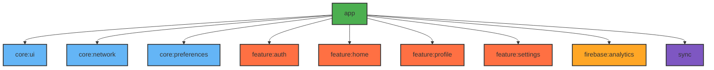

# Module :app

Main application module that coordinates feature modules and handles app-level configuration.

## Dependencies Graph



## Key Features

- Main application
- Feature coordination
- Analytics setup
- Splash screen
- Version management
- ProGuard rules

## Version Management

```kotlin
// ... Application Version ...
val majorUpdateVersion = 1
val minorUpdateVersion = 0
val patchVersion = 0

val mVersionCode = majorUpdateVersion.times(10_000)
    .plus(minorUpdateVersion.times(100))
    .plus(patchVersion)
```