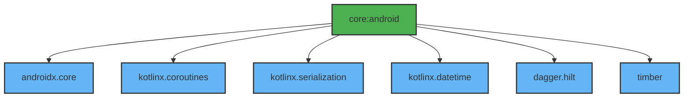

# Module :core:android

This module serves as the foundation for all Android-specific functionality in the project. It
provides essential utilities, extensions, and base dependencies that are used across the
application.

## Features

- Core Android Extensions and Utils
- Coroutine Support
- JSON Serialization
- Date/Time Utilities
- Logging Infrastructure
- Base Hilt Setup

## Dependencies Graph



## Usage

This module is typically used as a dependency in other modules that require Android functionality:

```kotlin
dependencies {
    implementation(project(":core:android"))
}
```

All dependencies in this module are exposed as `api` to make them available to dependent modules.