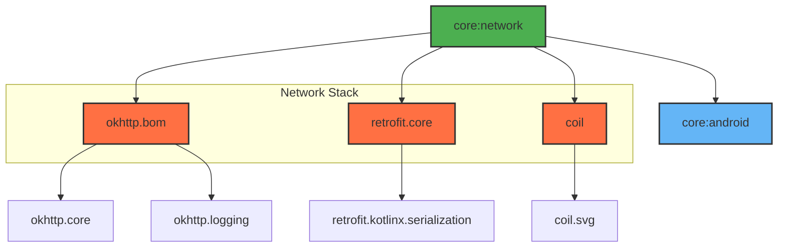

# Module :core:network

This module handles all network-related operations, including API communication, image loading, and
network state monitoring. It provides a centralized way to manage network requests and responses.

## Features

- REST API Communication (Retrofit)
- Network Interceptors (OkHttp)
- Image Loading (Coil)
- Network State Monitoring
- Secrets Management

## Dependencies Graph



## Usage

```kotlin
dependencies {
    implementation(project(":core:network"))
}
```

### Secret Management

Uses Gradle secrets plugin to manage API keys and endpoints:

```properties
# secrets.defaults.properties (version controlled)
apiKey=dummy-key
apiEndpoint=https://example.com
# local.properties (not version controlled)
apiKey=actual-secret-key
apiEndpoint=actual-endpoint
```
