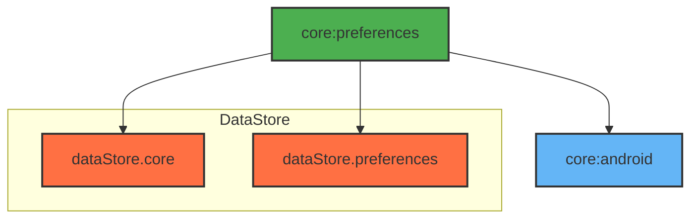

# Module :core:preferences

This module handles local data persistence using DataStore Preferences. It provides type-safe access
to user preferences and app settings with support for serialization and migrations.

## Features

- Type-safe Preferences Storage
- Reactive Updates with Flow
- Custom Serializers

## Dependencies Graph



## Usage

```kotlin
dependencies {
    implementation(project(":core:preferences"))
}
```

### Data Storage

```kotlin
@Serializable
data class UserPreferences(
    val darkMode: Boolean = false,
    val notifications: Boolean = true
)

class PreferencesDataSource @Inject constructor(
    private val dataStore: DataStore<UserPreferences>
) {
    val preferences: Flow<UserPreferences> = dataStore.data

    suspend fun updateDarkMode(enabled: Boolean) {
        dataStore.updateData {
            it.copy(darkMode = enabled)
        }
    }
}
```

ProGuard rules are included for serialization support.