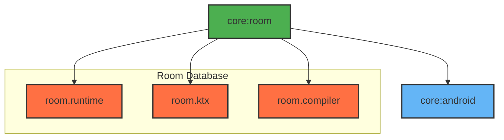

# Module :core:room

This module provides local database functionality using Room ORM. It handles data persistence,
caching, and offline-first capabilities for the application.

## Features

- SQLite Database Access
- Type-safe DAO Operations
- Reactive Queries with Flow

## Dependencies Graph



## Usage

```kotlin
dependencies {
    implementation(project(":core:room"))
}
```

### Database Setup

```kotlin
@Entity(tableName = "items")
data class ItemEntity(
    @PrimaryKey val id: String,
    val name: String,
    val lastUpdated: Long = System.currentTimeMillis()
)

@Dao
interface ItemDao {
    @Query("SELECT * FROM items")
    fun observeItems(): Flow<List<ItemEntity>>

    @Insert(onConflict = OnConflictStrategy.REPLACE)
    suspend fun insertItem(item: ItemEntity)
}
```

### Room Migration

Database migrations are handled automatically through version increments in the `@Database`
annotation.