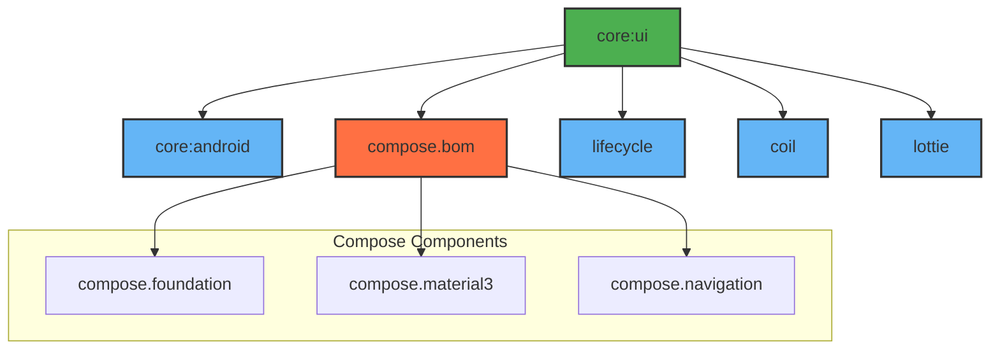

# Module :core:ui

This module contains all the common UI components, theming, and design system elements used
throughout the application. It provides a consistent look and feel across all features.

## Features

- Material3 Design System
- Common UI Components
- Theme Configuration
- Navigation Setup
- Image Loading
- Animation Support

## Dependencies Graph



## Usage

This module is used by all feature modules that require UI components:

```kotlin
dependencies {
    implementation(project(":core:ui"))
}
```

### Key Components

- **Design System**: Common theme, typography, and color schemes
- **Reusable Components**: Common UI components like buttons, text fields, etc.
- **Navigation**: Type-safe navigation utilities
- **Image Loading**: Coil integration for efficient image loading
- **Animations**: Lottie integration for rich animations

All UI dependencies are exposed as `api` to ensure consistent versioning across the app.