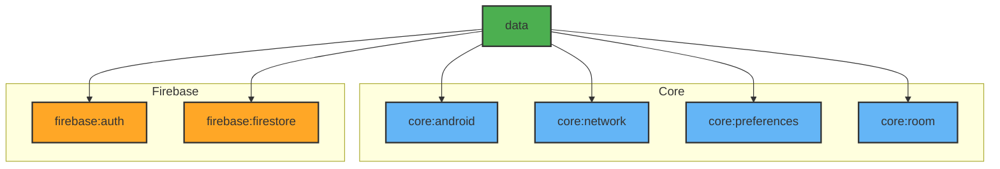

# Module :data

Central data management module that coordinates between local and remote data sources.

## Dependencies Graph



## Key Components

- Repository implementations
- Data models and mappers
- Offline-first logic
- Synchronization handling
- Error management

## Implementation Pattern

```kotlin
interface YourRepository {
    fun getData(): Flow<List<Data>>
}

class YourRepositoryImpl @Inject constructor(
    private val localDataSource: LocalDataSource,
    private val remoteDataSource: RemoteDataSource
) : YourRepository {
    override fun getData(): Flow<List<Data>> =
        networkBoundResource(
            query = { localDataSource.getData() },
            fetch = { remoteDataSource.getData() },
            saveFetchResult = { localDataSource.saveData(it) }
        )
}
```