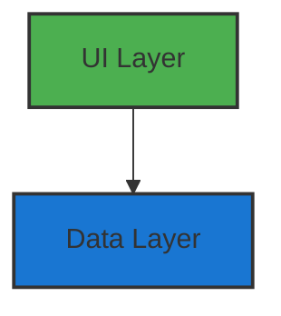
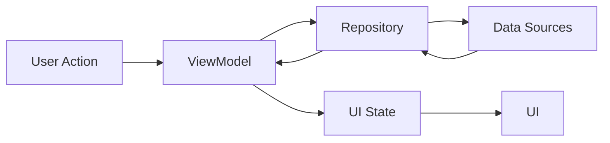

# Architecture Overview

This project follows the
official [Android Architecture Guidelines](https://developer.android.com/topic/architecture) with
some pragmatic adaptations to keep the codebase simple and maintainable.

## Architectural Principles

The architecture is built on several key principles:

1. **Separation of Concerns**: Each component has its own responsibility
2. **Single Source of Truth**: Data is managed in a single place
3. **Unidirectional Data Flow**: Data flows in one direction, events flow in the opposite
4. **State-Based UI**: UI is a reflection of the state
5. **Pragmatic Simplicity**: Complex patterns are only added when necessary

## Core Layers

The app uses a two-layer architecture:



### UI Layer

The UI layer follows MVVM pattern and consists of:

1. **Composable UI**: Pure UI components built with Jetpack Compose
2. **ViewModel**: Manages UI state and business logic
3. **UI State**: Immutable data classes representing screen state

Example UI Layer structure:

```kotlin
data class HomeScreenData(
    val items: List<Item> = emptyList(),
    // other UI state properties
)

@HiltViewModel
class HomeViewModel @Inject constructor(
    private val repository: HomeRepository
) : ViewModel() {
    private val _uiState = MutableStateFlow(UiState(HomeScreenData()))
    val uiState = _uiState.asStateFlow()
}

@Composable
fun HomeScreen(
    uiState: HomeScreenData,
    onAction: (HomeAction) -> Unit
) {
}
```

### Data Layer

The data layer handles data operations and consists of:

1. **Repositories**: Single source of truth for data
2. **Data Sources**: Interface with external systems (API, database, etc.)
3. **Models**: Data representation classes

Example Data Layer structure:

```kotlin
class HomeRepositoryImpl @Inject constructor(
    private val localDataSource: LocalDataSource,
    private val networkDataSource: NetworkDataSource
) : HomeRepository {
    override fun getData(): Flow<List<Data>> =
        networkBoundResource(
            query = { localDataSource.getData() },
            fetch = { networkDataSource.getData() },
            saveFetchResult = { localDataSource.saveData(it) }
        )
}
```

> [!NOTE]
> Unlike the official guidelines, this project intentionally omits the domain layer to reduce
> complexity. You can add a domain layer if your app requires complex business logic or needs to
> share
> logic between multiple ViewModels.

## State Management

The project uses a consistent state management pattern:

1. **UiState Wrapper**:

    ```kotlin
    data class UiState<T : Any>(
        val data: T,
        val loading: Boolean = false,
        val error: OneTimeEvent<Throwable?> = OneTimeEvent(null)
    )
    ```

2. **State Updates**:

    ```kotlin
    // Regular state updates
    _uiState.updateState { copy(value = newValue) }
    
    // Async operations
    _uiState.updateStateWith(viewModelScope) {
        repository.someAsyncOperation()
    }
    ```

3. **State Display**:

    ```kotlin
	@Composable
    fun StatefulScreen(
        state: UiState<ScreenData>,
        onShowSnackbar: suspend (String, SnackbarAction, Throwable?) -> Boolean
    ) {
        StatefulComposable(
            state = state,
            onShowSnackbar = onShowSnackbar
        ) { screenData ->
            // UI Content
        }
    }
    ```

## Dependency Injection

The project uses Hilt for dependency injection:

- **Modules**: Organized by feature and core functionality
- **Scoping**: Primarily uses singleton scope for repositories and data sources
- **Testing**: Enables easy dependency replacement for testing

## Data Flow

1. **User Interaction** → UI Events
2. **ViewModel** → Business Logic
3. **Repository** → Data Operations
4. **DataSource** → External Systems
5. **Back to UI** through StateFlow



## Adding a Domain Layer

If your app grows in complexity, you can add a domain layer:

```kotlin
class GetDataUseCase @Inject constructor(
    private val repository: Repository
) {
    suspend operator fun invoke(params: Params): Result<Data> =
        repository.getData(params)
}
```

> [!TIP]
> Consider adding a domain layer when:
> - Multiple ViewModels share business logic
> - Business rules become complex
> - You need to transform data between layers

## Testing Strategy (Upcoming 🚧)

The architecture enables different types of tests:

1. **UI Tests**: Test Composables in isolation
2. **ViewModel Tests**: Test state management and business logic
3. **Repository Tests**: Test data operations
4. **Integration Tests**: Test multiple layers together

## Best Practices

1. **Keep UI State Simple**: Only include what's needed for the UI
2. **Single Responsibility**: Each class should have one clear purpose
3. **Error Handling**: Use Result type for operations that can fail
4. **Coroutines**: Use structured concurrency with proper scoping
5. **Immutable Data**: Use data classes for state and models

## Further Reading
- [Design Philosophy](philosophy.md): Understand the design principles behind the architecture
- [Adding New Features](guide.md): Learn how to add new features to the project
- [CI/CD Setup](github.md): Set up continuous integration and deployment for the project
- [Performance Optimization](performance.md): Optimize the app for speed and efficiency
- [Useful Tips & Tricks](tips.md): Get useful tips for development and debugging
- [Convention Plugins](plugins.md): Learn about custom Gradle plugins used in the project
- [Code Style with Spotless](spotless.md): Follow code formatting guidelines for the project
