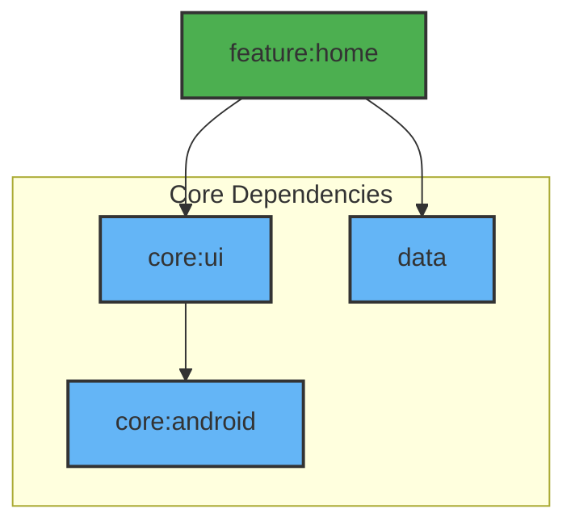

# Module :feature:home

Main feature module implementing the home screen with item list and CRUD operations.

## Features

- Item List Display
- Create/Edit Items
- Delete with Undo
- Offline Support
- Pull to Refresh
- Background Sync

## Dependencies Graph



## Key Components

1. **Home Screen**: Shows the list of items

	```kotlin
	@Composable
	fun HomeRoute(
	    onItemClick: (String) -> Unit,
	    onShowSnackbar: suspend (String, SnackbarAction, Throwable?) -> Boolean
	)
	```

2. **Item Screen**: Create/Edit item screen

	```kotlin
	@Composable
	fun ItemRoute(
	   onBackClick: () -> Unit,
	   onShowSnackbar: suspend (String, SnackbarAction, Throwable?) -> Boolean
	)
	```