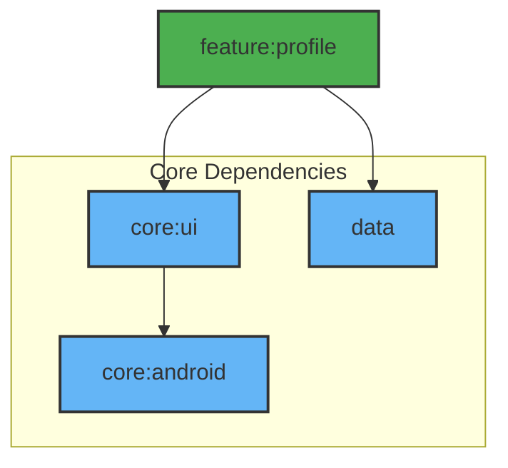

# Module :feature:profile

User profile management module with account details and preferences.

## Features

- Profile Information Display
- Avatar Management
- Account Settings
- User Stats
- Sign Out Flow

## Dependencies Graph



## Key Components

1. **Profile Screen**: Shows the user profile information

	```kotlin
	@Composable
	fun ProfileRoute(
	  onShowSnackbar: suspend (String, SnackbarAction, Throwable?) -> Boolean
	)
	```