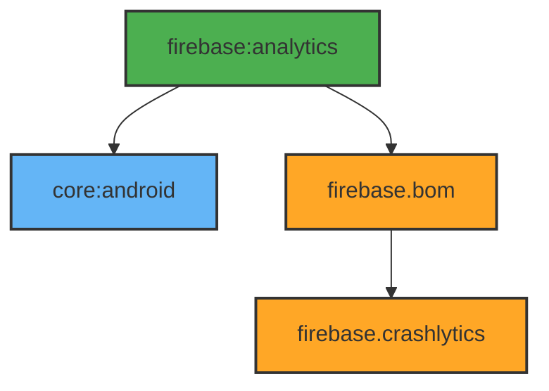

# Module :firebase:analytics

This module handles crash reporting and analytics through Firebase Crashlytics. It provides a
centralized way to track app crashes and report exceptions.

## Features

- Crash Reporting
- Error Tracking
- Exception Handling
- Custom Error Reports

## Dependencies Graph



## Usage

```kotlin
dependencies {
    implementation(project(":firebase:analytics"))
}
```

### Error Reporting

```kotlin
class YourClass @Inject constructor(
    private val crashReporter: CrashReporter
) {
    fun handleError(error: Throwable) {
        crashReporter.reportException(error)
    }
}
```

The module integrates with the app's error handling system to automatically report uncaught
exceptions to Firebase Crashlytics.