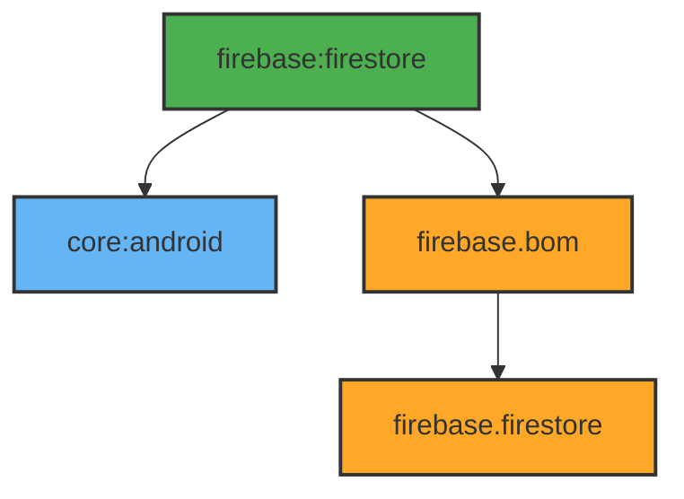

# Module :firebase:firestore

This module provides cloud data storage using Firebase Firestore. It handles data synchronization,
real-time updates, and offline persistence.

## Features

- Cloud Data Storage
- Real-time Updates
- Offline Persistence
- Batch Operations
- Security Rules Integration
- Data Serialization

## Dependencies Graph



## Usage

```kotlin
dependencies {
    implementation(project(":firebase:firestore"))
}
```

### Data Operations

```kotlin
class FirestoreDataSource @Inject constructor(
    firestore: FirebaseFirestore
) {
    private val collection = firestore
        .collection("your_collection")

    suspend fun getData(userId: String): List<Data> =
        collection
            .whereEqualTo("userId", userId)
            .get()
            .await()
            .toObjects()

    suspend fun createData(data: Data) =
        collection
            .document(data.id)
            .set(data)
            .await()
}
```

### Security Rules

The module expects proper Firestore security rules to be set up. Checkout
the [Firestore Security Rules](https://firebase.google.com/docs/firestore/security/get-started)
documentation for more details.

```javascript
rules_version = '2';
service cloud.firestore {
  match /databases/{database}/documents {
    match /{document=**} {
      allow read, write: if request.auth != null;
    }
  }
}
```

All operations are performed with proper security context and error handling.