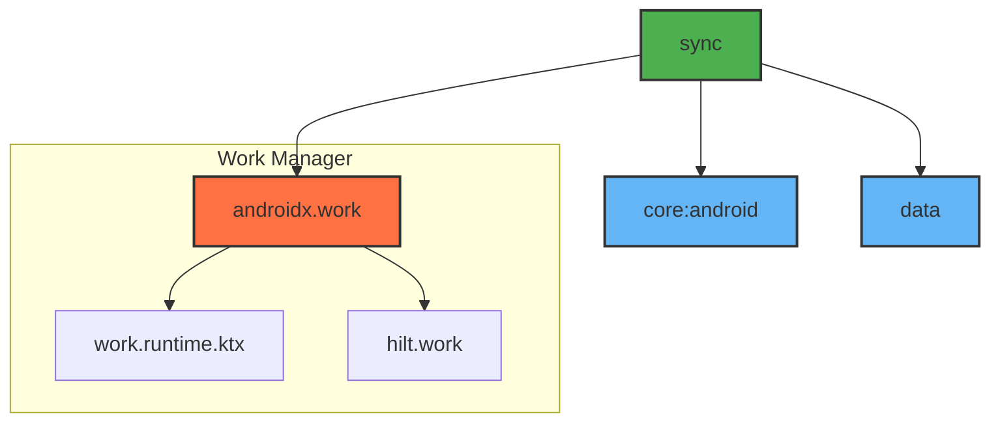

# Module :sync

This module handles background data synchronization using WorkManager. It ensures data consistency
between local and remote data sources by performing periodic and on-demand sync operations.

## Features

- Background Synchronization
- Periodic Sync Scheduling
- Work Constraints Management
- Progress Tracking
- Error Handling
- Hilt Worker Integration

## Dependencies Graph



## Usage

```kotlin
dependencies {
    implementation(project(":sync"))
}
```

### Setting Up Sync

1. Make your repository syncable:

	```kotlin
	interface YourRepository : Syncable {
	    override suspend fun sync(): Flow<SyncProgress>
	}
	```

2. Create sync worker:

	```kotlin
	@HiltWorker
	class SyncWorker @AssistedInject constructor(
	    @Assisted context: Context,
	    @Assisted params: WorkerParameters,
	    private val repository: YourRepository
	) : CoroutineWorker(context, params) {
	    override suspend fun doWork(): Result {
	        repository.sync()
	            .collect { progress ->
	                setProgress(progress.toWorkData())
	            }
	        return Result.success()
	    }
	}
	```

3. Request sync operation:

	```kotlin
	class YourRepositoryImpl @Inject constructor(
	    private val syncManager: SyncManager
	) : YourRepository {
	    fun requestSync() {
	        syncManager.requestSync()
	    }
	}
	```

### Work Constraints

The sync operation respects the following constraints:

- Network availability
- Battery not low
- Storage not low
- Device idle (for periodic sync)

### Progress Tracking

```kotlin
data class SyncProgress(
    val total: Int = 0,
    val current: Int = 0,
    val message: String? = null
)
```

The sync progress can be observed from the WorkManager's progress updates.